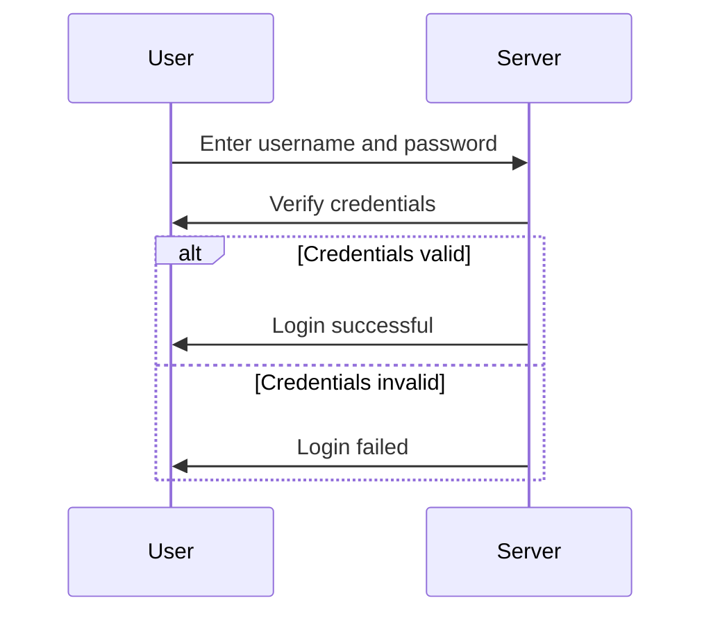

# Booking project Design

## Sequence diagram
This is the authentication sequence diagram.

```mermaid
sequenceDiagram
    participant User
    participant Server
    User->>Server: Enter username and password
    Server->>User: Verify credentials
    alt Credentials valid
        Server->>User: Login successful
    else Credentials invalid
        Server->>User: Login failed
    end
```
